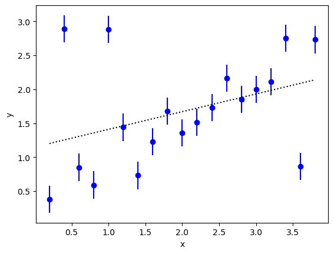
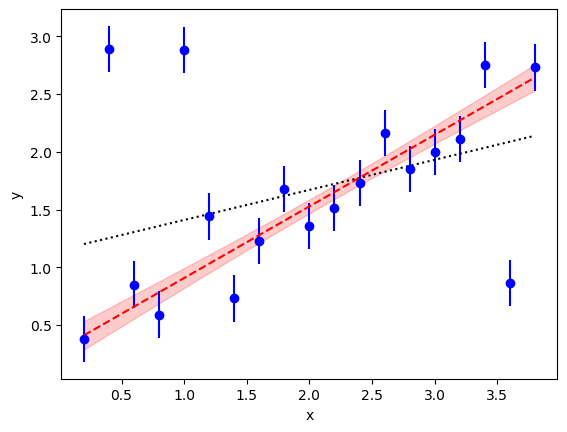

.. |GVar| replace:: :class:`gvar.GVar`
.. |nonlinear_fit| replace:: :class:`lsqfit.nonlinear_fit`
.. |BufferDict| replace:: :class:`gvar.BufferDict`
.. |~| unicode:: U+00A0
   :trim:

.. _case_curve_fitting:

Case Study: Bayesian Curve Fitting
=====================================================
In this case study, we use :mod:`vegas` to fit a straight line 
to data with with outliers. We use the specialized 
integrator :class:`PDFIntegrator` with a non-Gaussian 
probability density function (PDF) in a Bayesian 
analysis. We look at two examples,
one with 4 |~| parameters 
and the other with 22 |~| parameters. 

This case study is adapted from an example by Jake Vanderplas
on his `Python blog <http://jakevdp.github.io/blog/2014/06/06/frequentism-and-bayesianism-2-when-results-differ>`_.
It is also discussed in the documentation for the :mod:`lsqfit` module.

The Problem
------------------
We want to extrapolate the ``y`` values in the following figure to ``x=0``:

A linear least-squares fit to the data (dotted line) is unconvincing; in particular,
the extrapolated value at ``x=0`` is larger than one while most of the data 
near ``x=0`` suggest an intercept less than |~| 0.5. The problem, of course, is 
caused by the outliers. There are at least three outliers.

A Solution
-----------------
There are many *ad hoc* prescriptions for handling outliers. In the best
of situations one has an explanation for the outliers and can
model them accordingly. For example,
we might know that some fraction :math:`w` of the time our device
malfunctions, resulting in much larger measurement errors than usual.
This can be modeled in a Bayesian analysis by describing the 
data using a linear 
combination of two 
Gaussian probability density functions (PDFs). 
One is the usual PDF proportional to the 
product of :math:`exp(-(y-f(x))^2  / 2\sigma_y^2))`
over all data points, where the fit function :math:`f(x)` 
is :math:`c_0 + c_1 x`. The second is the same but 
with the :math:`\sigma_y \to b \sigma_y` for some |~| :math:`b>1`. 
The relative weights assigned to 
these two terms are :math:`1-w`` and :math:`w`, respectively.

The following code does a Bayesian fit with this modified PDF::

    import numpy as np
    import gvar as gv
    import vegas

    def main():
        # 1) create data
        x = np.array([
            0.2, 0.4, 0.6, 0.8, 1.,
            1.2, 1.4, 1.6, 1.8, 2.,
            2.2, 2.4, 2.6, 2.8, 3.,
            3.2, 3.4, 3.6, 3.8
            ])
        y = gv.gvar([
            '0.38(20)', '2.89(20)', '0.85(20)', '0.59(20)', '2.88(20)',
            '1.44(20)', '0.73(20)', '1.23(20)', '1.68(20)', '1.36(20)',
            '1.51(20)', '1.73(20)', '2.16(20)', '1.85(20)', '2.00(20)',
            '2.11(20)', '2.75(20)', '0.86(20)', '2.73(20)'
            ])
        
        # 2) create prior and modified PDF
        prior = make_prior()
        mod_pdf = ModifiedPDF(data=(x, y), fcn=fitfcn, prior=prior)

        # 3) create integrator and adapt it to the modified PDF
        expval = vegas.PDFIntegrator(prior, pdf=mod_pdf)
        nitn = 10
        neval = 10_000
        warmup = expval(neval=neval, nitn=nitn)

        # 4) evaluate expectation value of g(p)
        @vegas.rbatchintegrand
        def g(p):
            w = p['w']
            b = p['b']
            c = p['c']
            c_outer = c[:, None] * c[None,:]
            return dict(w=[w, w**2] , b=[b, b**2], c_mean=c, c_outer=c_outer)
        results = expval(g, neval=neval, nitn=nitn, adapt=False)
        print(results.summary())

        # 5) print out results
        print('vegas results:')
        # c[i]
        cmean = results['c_mean']
        cov = results['c_outer'] - np.outer(cmean, cmean)
        cov = (cov + cov.T) / 2
        # w, b
        wmean, w2mean = results['w']
        wsdev = (w2mean - wmean**2)**0.5
        bmean, b2mean = results['b']
        bsdev = (b2mean - bmean**2)**0.5        
        print('  c means =', cmean)
        print('  c cov =', str(cov).replace('\n', '\n' + 10*' '))
        print('  w mean =', str(wmean).replace('\n', '\n' + 11*' '))
        print('  w sdev =', str(wsdev).replace('\n', '\n' + 11*' '))
        print('  b mean =', bmean)
        print('  b sdev =', bsdev)
        # Bayes Factor
        print('\n  logBF =', np.log(results.pdfnorm))
        
        print('\nCombine vegas errors with covariances for final results:')
        # N.B. vegas errors are actually insignificant compared to covariances
        c = cmean + gv.gvar(np.zeros(cmean.shape), gv.mean(cov))
        w = wmean + gv.gvar(np.zeros(np.shape(wmean)), gv.mean(wsdev))
        b = bmean + gv.gvar(np.zeros(np.shape(bmean)), bsdev.mean)
        print('  c =', c)
        print('  corr(c) =', str(gv.evalcorr(c)).replace('\n', '\n' + 12*' '))
        print('  w =', str(w).replace('\n', '\n' + 6*' '))
        print('  b =', b, '\n')
            
    def fitfcn(x, p):
        c = p['c']
        return c[0] + c[1] * x

    def make_prior(w_shape=()):
        prior = gv.BufferDict()
        prior['c'] = gv.gvar(['0(5)', '0(5)'])
        # uniform distributions for w and b
        prior['gw(w)'] = gv.BufferDict.uniform('gw', 0., 1., shape=w_shape)
        prior['gb(b)'] = gv.BufferDict.uniform('gb', 5., 20.)
        return prior

    @vegas.rbatchintegrand
    class ModifiedPDF:
        """ Modified PDF to account for measurement failure. """

        def __init__(self, data, fcn, prior):
            x, y = data
            # add rbatch index to arrays
            self.x = x[:, None]
            self.y = y[:, None]
            self.fcn = fcn
            self.prior = gv.BufferDict()
            self.prior['c'] = prior['c'][:, None]
            if np.shape(prior['gw(w)']) != ():
                self.prior['gw(w)'] = prior['gw(w)'][:, None]
            else:
                self.prior['gw(w)'] = prior['gw(w)']
            self.prior['gb(b)'] = prior['gb(b)']

        def __call__(self, p):
            y_fx = self.y - self.fcn(self.x, p)
            data_pdf1 = self.gaussian_pdf(y_fx)
            data_pdf2 = self.gaussian_pdf(y_fx, broaden=p['b'])
            prior_pdf = np.prod(
                self.gaussian_pdf(p['c'] - self.prior['c']), 
                axis=0
                )
            # Gaussians for gw(w) and gb(b)
            if np.shape(self.prior['gw(w)']) == ():
                prior_pdf *= self.gaussian_pdf(p['gw(w)'] - self.prior['gw(w)'])
            else:
                prior_pdf *= np.prod(
                    self.gaussian_pdf(p['gw(w)'] - self.prior['gw(w)']), 
                    axis=0
                    )
            prior_pdf *= self.gaussian_pdf(p['gb(b)'] - self.prior['gb(b)'])
            # p['w'] derived (automatically) from p['gw(w)']
            w = p['w']
            ans = np.prod((1. - w) * data_pdf1 + w * data_pdf2, axis=0) * prior_pdf
            return ans

        @staticmethod
        def gaussian_pdf(x, broaden=1.):
            xmean = gv.mean(x)
            xvar = gv.var(x) * broaden ** 2
            return gv.exp(-xmean ** 2 / 2. /xvar) / gv.sqrt(2 * np.pi * xvar)

    if __name__ == '__main__':
        main()

Here class ``ModifiedPDF`` implements the modified PDF. The parameters for 
this distribution are the fit function coefficients ``c = p['c']``, the 
weight ``w = p['w']``, and a breadth parameter ``p['b']``. As usual the PDF for
the parameters (in ``__call__``) is the product of a PDF for the data times a
PDF for the priors. The data PDF consists of the two Gaussian distributions: 
one, ``data_pdf1``, with the
nominal data errors and weigth ``(1-w)``, and the other, ``data_pdf2``, 
with errors that are ``p['b']``
times larger and weigth |~| ``w``.

We want broad Gaussian priors for the fit function coefficients, but 
uniform priors for the weight parameter (:math:`0<w<1`) and breadth
parameter (:math:`5<b<20`). An easy way to implement the uniform 
priors for use by :class:`vegas.PDFIntegrator` is to replace the weight
and breadth parameters by new parameters ``p['gw(w)']`` and ``p['gb(b)']``,
respectively, that map the uniform distributions onto Gaussian 
distributions |~| (0 |~| ± |~| 1). Values for the weight ``p['w']`` and breadth 
``p['b']`` are then obtained from the new variables using the inverse map. 
This strategy is easily implemented using a :class:`gvar.BufferDict` 
dictionary to describe the parameter prior.

The parameter priors are specified in ``make_prior()`` which returns the
``BufferDict`` dictionary, with a Gaussian random variable 
(a :class:`gvar.GVar`) for each parameter. 
The fit function coefficients
(``prior['c']``) have broad priors: |~| 0 |~| ± |~| 5. The prior for 
parameter ``p['gw(w)']`` is specified by ::

    prior['gw(w)'] = gv.BufferDict.uniform('gw', 0., 1.)

which assigns it a Gaussian prior |~| (0 |~| ± |~| 1) while also instructing
any ``BufferDict`` dictionary ``p`` that includes a value for 
``p['gw(w)']``  to automatically generate the corresponding value for the 
weight ``p['w']``. This makes the weight parameter 
available automatically even though :class:`vegas.PDFIntegrator`
integrates over |~| ``p['gw(w)']``. The same strategy is used 
for the breadth parameter.

The Bayesian integrals are estimated using :class:`vegas.PDFIntegrator`
``expval``, which is created from the prior.
It is used to evaluate expectation values of arbitrary functions of the
fit variables. Here it optimizes the integration variables for integrals
of the prior's PDF, but replaces that PDF with the modified PDF when 
evaluating expectation values.

We first call ``expval`` with no function, to allow the integrator to adapt
to the modified PDF. We then use the integrator to evaluate the expectation value of
function ``g(p)``, but now with ``adapt=False`` to get more reliable
error estimates. The output dictionary ``results``
contains expectation values of the corresponding entries in the dictionary
returned ``g(p)``. These data allow us to calculate means, standard deviations
and correlation matrices for the fit parameters.

Note that ``g(p)`` and ``mod_pdf(p)`` are both batch integrands, with the 
batch index on the right (i.e., the last index). This significantly 
reduces the time required for the integrations.

The results from this code are as follows:

.. literalinclude:: outliers1.out

The table shows results for the normalization of the
modified PDF from each of the ``nitn=10`` iterations of the :mod:`vegas`
algorithm used to estimate the integrals. The logarithm of the normalization
(``logBF``) is -23.8. This is the logarithm of the Bayes Factor (or Evidence)
for the fit. It
is much larger than the value -117.5 obtained from a least-squares fit (i.e.,
from the script above but with ``w=0`` in the PDF). This means that the 
data much prefer the
modified prior (by a factor of :math:`exp(-23.8 + 117.4)` or about 10\ :sup:`41`).

The new fit parameters are much more reasonable than the results from the 
least-squares fit. In particular the
intercept is 0.29(14) which 
is much more plausible than the least-squares result (compare the dashed line in red
with the dotted line):

Note, from the correlation matrix, that the intercept and slope are
anti-correlated, as one might guess for this fit.
The analysis also gives us an estimate for the failure rate ``w=0.27(12)``
of our devices --- they fail about a quarter of the time --- and 
shows that the ``y`` errors are ``b=10.6(3.7)`` times larger when 
there is a failure.

Finally, note that the Monte Carlo integrations can be made more than 
twice as accurate (or faster) by using the results of a least-squares fit 
in place of the 
prior to define the :class:`vegas.PDFIntegrator`. This is done, for 
example, using the :mod:`lsqfit` module to replace ::

    expval = vegas.PDFIntegrator(prior, pdf=mod_pdf)

by ::

    fit = lsqfit.nonlinear_fit(data=(x,y), prior=prior, fcn=fitfcn)
    expval = vegas.PDFIntegrator(fit.p, pdf=mod_pdf)

where ``fit.p`` are the best-fit values of the parameters from the fit.
The values of the expectation values are unchanged in the second 
case but the optimized integration variables used by 
:class:`vegas.PDFIntegrator` are better suited to the 
PDF.

A Variation
------------------
A somewhat different model for the data PDF assigns a separate value 
``w`` to each data point. The script above does this if ::

    prior = make_prior()

is replaced by ::

    prior = make_prior(w_shape=19)

The Bayesian integral then has 22 |~| parameters, rather than the 4 |~| parameters
before. The code still takes only seconds to run on a 2020 laptop.

The final results are quite similar to the other model:

.. literalinclude:: outliers2.out

The logarithm of the Bayes Factor ``logBF`` is slightly lower for
this model than before. It is also less accurately determined (15x), because
22-parameter integrals are considerably more difficult than 4-parameter
integrals. More precision can be obtained by increasing ``neval``, but
the current precision is more than adequate.

Only three of the ``w[i]`` values listed in the output are more than two
standard deviations away from zero. Not surprisingly, these correspond to
the unambiguous outliers. The fit function parameters are almost the same 
as before.

The outliers in this case are pretty obvious; one is tempted to simply drop
them. It is clearly better, however, to understand why they have occurred and
to quantify the effect if possible, as above. Dropping outliers would be much
more difficult if they were, say, three times closer to the rest of the data.
The least-squares fit would still be poor (``chi**2`` per degree of freedom of
3) and its intercept a bit too high (0.6(1)). Using the modified PDF, on the
other hand, would give results very similar to what we obtained above: for
example, the intercept would be 0.35(17).

